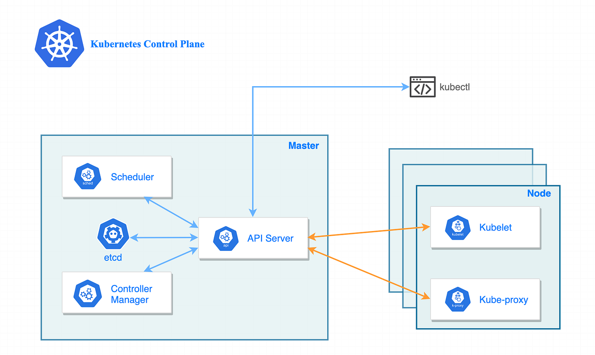

<h1 align="center">☸️ Kubernetes — My Learning Notes</h1>

<p align="center">
  <em>A personal, hands-on study guide for Kubernetes — architecture, components, and core concepts.</em>
</p>

<p align="center">
  
  
  
  
</p>

<p align="center">
  
  
  
</p>

<p align="center">
  
</p>

---

## 📚 What's Inside

| File | Description |
|---|---|
| [kubernetes-notes.md](./kubernetes-notes.md) | Architecture, control plane, worker node components, Pods, kubectl, Minikube & kind |

Plus screenshots from real kubectl / Minikube sessions.

---

## 🧠 Quick Refresher

> **Kubernetes** (K8s) is an **open-source container orchestration platform** that automates deploying, scaling, and managing containerized applications.

### Why Kubernetes?
- 🚀 **Auto-scaling** — handle traffic spikes automatically
- 🔄 **Self-healing** — restart failed containers, replace dead nodes
- 🧩 **Service discovery & load balancing** — built in
- 📦 **Rolling updates & rollbacks** — deploy with zero downtime
- ☁️ **Cloud-agnostic** — runs on AWS, GCP, Azure, on-prem, or even your laptop

---

## 🏗️ Architecture at a Glance

```
                     ┌────────────────────────────────┐
                     │      Control Plane (Master)    │
                     │                                │
                     │  API Server                    │
                     │  Scheduler                     │
                     │  Controller Manager            │
                     │  etcd (key-value store)        │
                     └──────────────┬─────────────────┘
                                    │
                ┌───────────────────┼───────────────────┐
                │                   │                   │
        ┌───────▼──────┐    ┌───────▼──────┐    ┌───────▼──────┐
        │ Worker Node  │    │ Worker Node  │    │ Worker Node  │
        │              │    │              │    │              │
        │  kubelet     │    │  kubelet     │    │  kubelet     │
        │  kube-proxy  │    │  kube-proxy  │    │  kube-proxy  │
        │  runtime     │    │  runtime     │    │  runtime     │
        │              │    │              │    │              │
        │  [Pods]      │    │  [Pods]      │    │  [Pods]      │
        └──────────────┘    └──────────────┘    └──────────────┘
```

➡️ Full breakdown in [kubernetes-notes.md](./kubernetes-notes.md)

---

## 🖼️ Screenshots from Practice

<p align="center">
  
  
  
</p>

---

## 🎯 Roadmap (What's Next)

- [x] Architecture — control plane & worker nodes
- [x] Pods & multi-container pods
- [x] kubectl basics + Minikube + kind
- [ ] Deployments, ReplicaSets, StatefulSets
- [ ] Services (ClusterIP, NodePort, LoadBalancer)
- [ ] ConfigMaps & Secrets
- [ ] Persistent Volumes & Storage Classes
- [ ] Helm charts
- [ ] Ingress controllers
- [ ] Kubernetes on the cloud (EKS / GKE / AKS)

---

## 🔗 Related

- [sakshi-2028/Docker](https://github.com/sakshi-2028/Docker) — Docker is the foundation Kubernetes builds on
- [sakshi-2028/100_Days_of_AWS](https://github.com/sakshi-2028/100_Days_of_AWS) — Cloud platform notes

---

## 📜 License

This project is licensed under the **MIT License** — see [LICENSE](./LICENSE) for details.
Feel free to fork and use these notes for your own learning. 🚀

---

<p align="center">Built with ❤️ by <a href="https://github.com/sakshi-2028">Sakshi Upadhyay</a></p>
